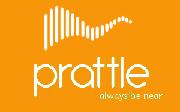

Prattle
===========

**NOTE : Branch master is updated only when the code has been improved/modified/updated significantly and is somewhat stable. Please check the [debug][1] branch for the latest changes.**

Prattle is a simple chat program written in C++, using SFML's networking module and TGUI for the GUI.

Currently, the features supported are:
* Basic registration
* Login
* Chatting in pairs

You can view our [to-do list][2] on Trello.

[1]: https://github.com/TheIllusionistMirage/Prattle/tree/debug "debug"
[2]: https://trello.com/b/7T367Ya3/current-to-do-list "to-do list"
