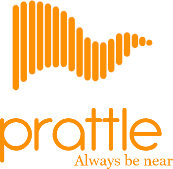

#Prattle




## What is Prattle?

Prattle is a simple chat program written in C++11, using SFML's networking
module (http://www.sfml-dev.org) and TGUI (https://tgui.eu) for the GUI.

Prattle has three components - **Prattle-Server**, **Prattle-Client** and **Prattle-Server-Controller**. Since Prattle follows a single server, multiclient architecture, the usage of the server and client involves running Prattle-Server on a, well, server, with OPEN_PORT (which is by default 19999) being set to a port cabable of listening for incoming connections. Then multiple clients can connect to it by getting access to the server's address. Multiple Prattle-Servers running on different hosts run independently of each other, i.e., no inter-server communication is possible. The Prattle-Server can be controlled remotely or on the same machine using Prattle-Server-Controller. The server controller features a bunch of shell like commands to manipulate the server and connected clients.

Currently, the features supported are:

* Registration (Username and password)
* Login
* Chatting in pairs (with multiple persons)
* Adding Friends
* Simple Notifications (for unread messages)
* Online Statuses
* Autologin (aka Remember Me facility)

For the details about the communication protocols we use, take a look at the
[network documentation][1].


### NOTE

We have not yet started with the security layer, so it's NOT recommended at
that Prattle be used for IM communication at this stage!


## Building & Running
Prattle conists of three separate CMake scripts for building `Prattle-Server`
`Prattle-Client` and `Prattle-Server-Controller`.

Build pre-requisites:
* C++11 compliant compiler
* SFML-2.3.x or greater
* TGUI-0.7.x or greater

#### *nix systems

Prattle-Server:
```
$ git clone https://github.com/TheIllusionistMirage/Prattle
$ cd Prattle/Server
$ mkdir build && cd build
$ cmake ..
$ make
```
An executable called `prattle-server` will be generated by the makefile.

Prattle-Client:
```
$ cd ../../
$ cd Client
$ mkdir build && cd build
$ cmake ..
$ make
```
An executable called `prattle-client` will be generated by the makefile.

Prattle-Server-Controller:
```
$ cd ../../
$ cd Server-Controller
$ mkdir build && cd build
$ cmake ..
$ make
```
An executable called `prattle-server-controller` will be generated by the makefile.


## Authors

See [AUTHORS][2]


## License

Prattle is licensed under the [MIT License][3].

## TODO

You can view our LONG [to-do list][4] and Prattle's development status on Trello.

[1]: https://github.com/TheIllusionistMirage/Prattle/blob/master/Documentation.md "network documentation"
[2]: https://github.com/TheIllusionistMirage/Prattle/blob/master/AUTHORS "AUTHORS"
[3]: https://github.com/TheIllusionistMirage/Prattle/blob/master/LICENSE.txt "MIT License"
[4]: https://trello.com/b/7T367Ya3/current-to-do-list "to-do list"
